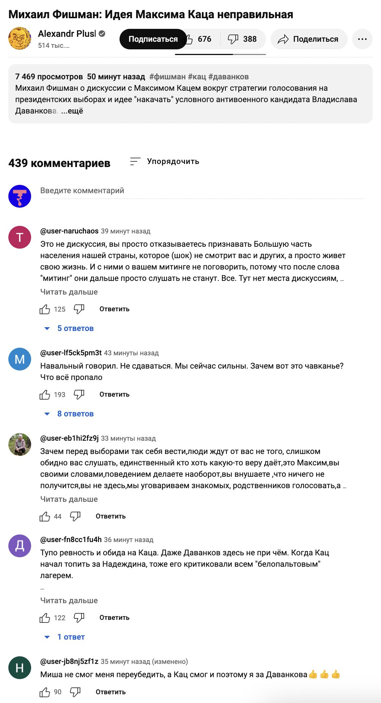
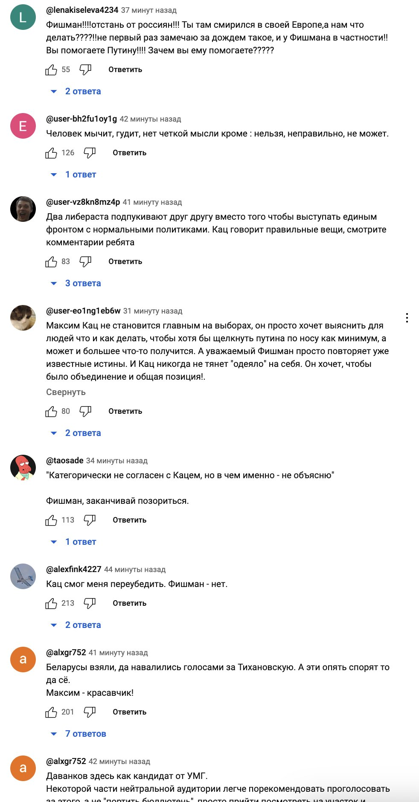
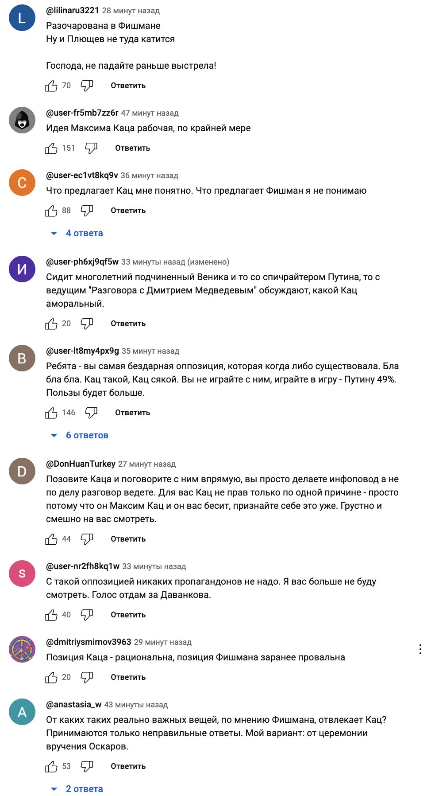
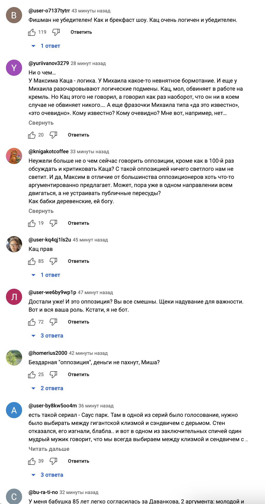

- [Претензия](https://youtu.be/r6grd5pCFPA?t=247)
	- Фишман утверждает, что невозможно добиться положительного результата с Даванковым, так как нет консенсуса голосовать за Даванкова (как было за Надеждина).
	- Надо поддерживать Полдень Против Путина (чего хотел бы Навальный).
- [Ответ Каца](https://www.youtube.com/watch?v=SleyUO4bMws)
	- До 7:50 лишь задаётся контекст и фиксируется общая позиция.
	- Сам ответ на претензию:
		- Заранее проигранная кампания бывает только если заранее в ней сдаться.
		  Например, в 2011-ом не было никакого протестного настроения, оно было создано с нуля.
		- Никакого общественного консенсуса вокруг Надеждина тоже не было. Кампания стала успешной лишь благодаря тому, что сначала один вышел, потом второй и третий, пока не стало стыдно всем остальным не выходить за Надеждина.
		  Кроме того, если даже смогли убедить собрать подписи Надеждину, то уж накидать бюллетеней за Даванкова-то явно будет проще.
	- Далее идёт просто повторение позиций Каца и инструкции как голосовать, а не ответ Фишману.
- [Один из ответов Фишмана на ответ Каца](https://www.youtube.com/watch?v=Z6SVvpOubag)
	- Thumbnail у видео:
	  collapsed:: true
		- 
	- Основные point-ы по теме. Фишман:
		- Не хочет участвовать в этой дискуссии, так как:
			- Не хочет делать Максима главным героем этих "выборов". Но умалять вклад Максима в антивоенное движение тоже не хочет.
		- Не нравится постоянно защищаться, что не работают на Путина.
		- Требуется объединяться и искать конструктив, а не искать точки для расхождения.
		- Надо отдать Максиму должное, он -- последовательный. Но поддерживать Даванкова -- это неправильно и нереалистично (надуть нельзя).
	- Общественная реакция:
	  collapsed:: true
		- 
		- 
		- 
		- 
- От себя добавлю:
	- Вообще-то Навальный [тоже призывал](https://navalny.com/p/6672/) **голосовать**, а не просто Полдень Против Путина.
	  collapsed:: true
		- "17 марта 2024 года [состоятся](http://duma.gov.ru/news/58458/)
		   президентские выборы. В этот день мы призываем всех прийти на участки и
		   проголосовать против Владимира Путина. Сделать это можно, поставив 
		  галочки за любого другого кандидата."
		- Оригинальный текст: [navaly_elections_2024_should_we_vote.html](../assets/navaly_elections_2024_should_we_vote_1710212499862_0.html)