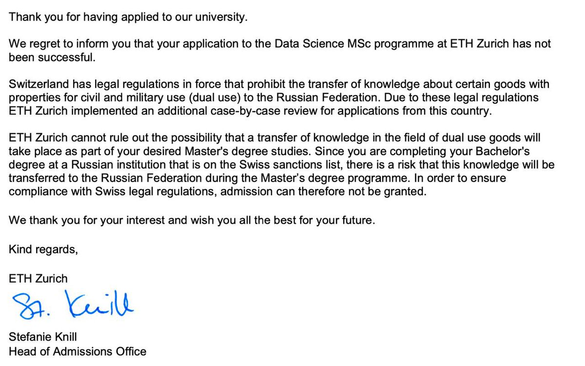
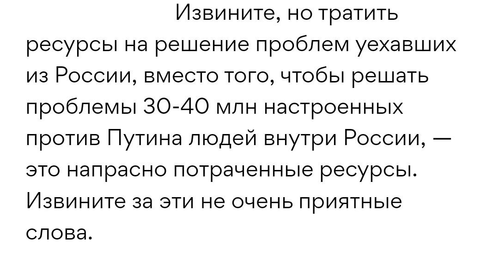
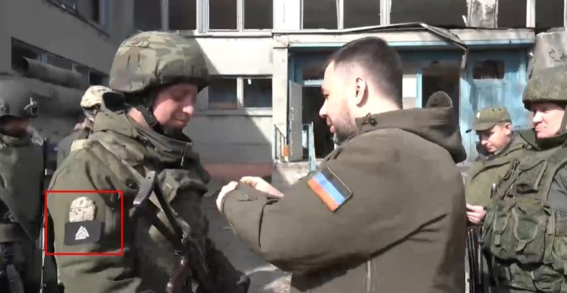
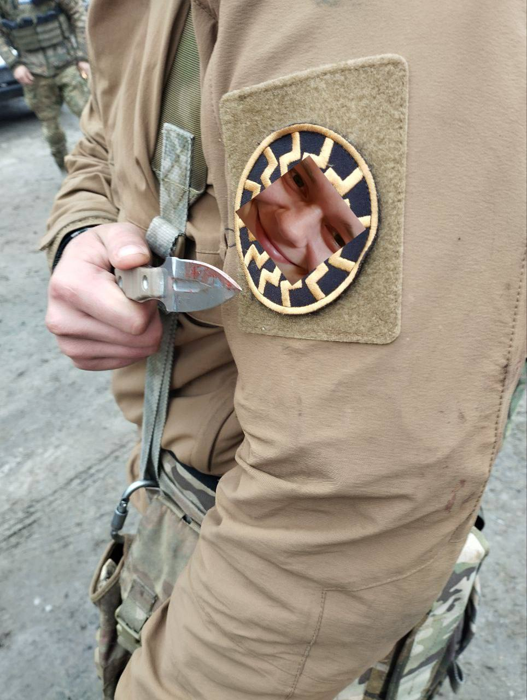

- В целом:
	- Потери
	  collapsed:: true
		- |2024-02-07|Украина|Гражданские|30010|[[UN/Report/ukraine_civilian_deaths_2024_01]]|
	- Военные преступления
	  collapsed:: true
		- Геноцид
		  collapsed:: true
			- 2022-04-08: [[Timothy Snyder]]: [Russia's genocide handbook](https://snyder.substack.com/p/russias-genocide-handbook)
			- 2022-05-07: [[Martin McKee]], [[Amir Attaran]], [[Jutta Lindert]]: [How can the international community respond to evidence of genocide in Ukraine?](https://www.ncbi.nlm.nih.gov/pmc/articles/PMC9198961/)
			- 2023-03-17: [[International Criminal Court]] [issued](https://news.un.org/en/story/2023/03/1134732) an arrest warrant for [[Vladimir Putin]] for war crimes of deportation and illegal transfer of children from occupied Ukraine to Russia.
	- Коллективная виновность россиян
	  collapsed:: true
		- Дебаты
		  collapsed:: true
			- [[Michael McFaul]]
			  collapsed:: true
				- [2024-03-14](https://twitter.com/McFaul/status/1768348988372353116):
				  collapsed:: true
					- Это война России, не только Путина.
					  Путин принял решение о вторжении в Украину. Но другие россияне, не Путин, убивают людей в Украине. Другие россияне продолжатют платить налоги, финансирующие эти убийства. Некоторые смелые россияне протестуют против войны. Большинство -- нет.
			- [[Maxim Mironov]]
			  collapsed:: true
				- [2024-03-14](https://twitter.com/mironov_fm/status/1768434021170639202?t=l2UXFxP8pqTmwtOvkVWIFA&s=19):
				  collapsed:: true
					- Майкл,
					- Как ученый, который детально исследовал данные, могу сказать, что это не россияне, а ЕС – главный спонсор путинской войны и убийства украинцев. В первые месяцы войны, с марта по июнь 2022, ЕС не только сократил финансовые перечисления Путину, но и резко их увеличил. Никогда до этого ЕС не отправлял Путину столько денег, как в марте-июне 2022 г. ЕС ежедневно (!!!) отправлял Путину в среднем 700 миллионов евро (!!!). Это было больше, чем все его затраты на войну. Так что можно с уверенностью сказать, что путинская война была полностью профинансирована ЕС.
					- Запад отправлял Путину столько денег, что Россия опухла от нефтегазодолларов. Не знала, куда их девать. Уже к июлю 2022 г. рубль укрепился до 51 рублей за доллар. Импорт полупроводников восстановился уже к июню 2022 до довоенного уровня, а потом его превысил. Путину помогли Китай, Турция и Эстония. А почему Путин смог обойти санкции? Потому что Запад в первые месяцы войны завалил Путина баблом, чтобы он себе не в чем не отказывал и мог спокойно убивать украинцев. И это Запад заваливал Путина миллиардами долларов и евро, а не россияне.
					- Так что это не россияне, а европейцы – главные спонсоры путинской войны. К тому же, если россияне перестанут платить налоги – то могут попасть в тюрьму. Майкл [@McFaul](https://twitter.com/McFaul), вы хотите попробовать на себе, что такое российская тюрьма? Если нет, то почему предлагаете такой опыт россиянам. В отличие от россиян, европейцы перечисляли сотни миллионов евро Путину абсолютно добровольно, с нулевыми рисками для себя оказаться в российской тюрьме или попасть под иное влияние путинской фашисткой репрессивной машины. Просто они не захотели потерять 3-4% ВВП, если бы сразу бы отказались покупать российский нефть и газ. Бизнес, ничего личного.
					- Так что это именно Запад продал Путину жизни сотни тысяч украинцев за несколько процентов ВВП. Именно Запад был все эти годы главным спонсором международного террориста Путина.
		- Перекосы
			- DonRumataEstor: [забанен в ЕС на 10 лет тупо по паспорта](https://x.com/DonRumataEstor/status/1769797225167602049?s=20)
			  collapsed:: true
				- Всё, отказали в последней судебной инстанции. 10 лет бана в ЕС - таков итог 8ми лет учебы в Швеции и работы в индустрии! Дальше ЕСПЧ. Ищем таких же бедолаг, кто пострадал за профессию и за паспорт т.к. известно что это не единичные случаи. Поэтому шведские, репостните где можно.
				- Моя история вкратце:
				- Выиграл стипендию 
				  
				  [@SweInstitute](https://twitter.com/SweInstitute)
				  
				  на учебу.
				- С большим трудом окончил здесь универ.
				- Долго искал работу в Швеции.  Нашел.
				- Потерял работу в ковид, но чудом нашел новую.
				- Работал здесь 6 лет начиная с консультанта и дорос до старшего разработчика.
				- Разрабатывал системы помощи водителю чтобы сделать дороги безопаснее
				  
				  В награду, миграционная система Швеции признаёт меня "угрозой безопасности" на основе неизвестных "потенциальных" рисков из-за места работы + 10 лет бана. Если это не депортация по паспорту, то что это тогда?
				- Известно, что я далеко не один такой. Складывается ощущение, что власти намеренно ломают карьеры россиянам, инженерам и учёным в каких-то областях техники и науки. Особый вид изощрённых санкций. Втихую. Откровенно говоря, про такую практику я нигде больше в Европе не слышал.
			- Alisa Iakupova: [не принята в институт тупо по паспорту](https://x.com/AlisaIakupova/status/1768308000630940046?s=20)
			  collapsed:: true
				- 
	- Антивоенное движение
	  collapsed:: true
		- [Reforum Space](https://t.me/ReforumTbilisi/701)
			- 💬 25 антивоенных проектов и больше 70 талантливых людей – резиденты нашего коворкинга и студии 🙏 
			  Здесь собрались как «взрослые» и большие проекты, так и начинающие инициативы. Используя Reforum как площадку для работы и сотрудничества, каждый проект и каждая инициатива вносит неоценимый вклад в борьбу за мир и демократию.
			- 🕊  Среди наших резидентов:
			- «Ковчег (https://kovcheg.live/)»‎ —  проект помощи российским эмигрантам 
			  «The Insider Live (https://www.youtube.com/channel/UCS3maDoYHOG7WzN_ESSWC-g)»‎ — журналисты, расследователи
			  «Идите Лесом (https://iditelesom.org/ru)» — проект, который помогает избежать мобилизации, срочной службы или дезертировать‎
			  «Ateo Breaking (https://t.me/Ateobreaking)» — интернет-издание
			  «Феминистское антивоенное сопротивление (https://t.me/femagainstwar)» — активистское движение
			  «Ребра Евы (https://www.rebraevy.ru/projects)»‎ — феминистский социально-художественный проект
			  «Хроники.Медиа (https://chronicles.media/)»‎ — антикоррупционный проект 
			  «Справимся вместе (https://queerhelp.me/)»‎ — сеть помощи людям, оказавшимся в ситуации партнерского насилия
			  «КУЛЬТРАССВЕТ (https://www.youtube.com/channel/UCbpEtUH3lqvW2prWikf1bow)» — youtube-канал.
			  Олег Петрович-Белкин (https://www.instagram.com/oleg_petrovich_belkin/) — историк, автор программы «15 принципов Новой внешней политики России» (https://reforum.io/contents/uploads/2023/05/reforum-foreign2.pdf)
			  Представители «Коалиции против пропаганды (https://t.me/addlist/kuJp_ui-CZllNDMy)»‎, включая команды «Пермь 36,6 (https://t.me/perm36)»‎, «Дозор в Волгограде (https://t.me/vashdozor)»‎, «Сердитая Чувашия (https://t.me/ChuvashiaDream)»‎, «Иркутский блог (https://t.me/irkblog)».
			- ✌ Спасибо всем проектам и участникам за вашу неутомимую работу.
			- Продолжим поддерживать друг друга и вместе двигаться к миру без войны и пропаганды.
	- Поддержка Украины
	- Дебаты по созданию политического представительтву для уехавших
	  collapsed:: true
		- [[Владимир Милов]] против
			- Аргумент
			  collapsed:: true
				- 
			- Ответ [[Кац]]-а
			  collapsed:: true
				- {{twitter https://x.com/Demarche_/status/1747775940162146339?s=20}}
	- Распознание войск
	  collapsed:: true
		- Россия
			- Шевроны
			  collapsed:: true
				- [Продажа трофейных](https://reibert.info/auctions/znaki-rozriznennja.192/)
					- 
				- Фотографии
					- Русич в ДНР
					  collapsed:: true
						- 
					- Подписчик TopaZ-а
					  collapsed:: true
						- 
- 2024:
	- "Выборы" Путина
	  collapsed:: true
		- {{embed [[Politics/Russia/Elections/President/2024]]}}
	- Кремлепропаганда упорно искала украинский след, несмотря на то, что ИГ-Х (подразделение ИГИЛ) взял на себя ответственность
		- См. [[Теракт в Крокус-Сити Холл]]
	- Дальнейшия действия оппозиции
	  collapsed:: true
		- Консолдиция
			- [Соцопрос негативное/позитивное отношение](https://x.com/vvaffles_/status/1773665353417027787?s=20)
			  collapsed:: true
				- [Сырые данные](https://docs.google.com/spreadsheets/d/1Dwyh1JEHYZ1H4wmlhuTvbQ_M6QtbbijE6am8iXnF8gk/edit#gid=993026458)
				- 
-