- Зачем консолдироваться (с простонародье "объединяться")
  collapsed:: true
	- 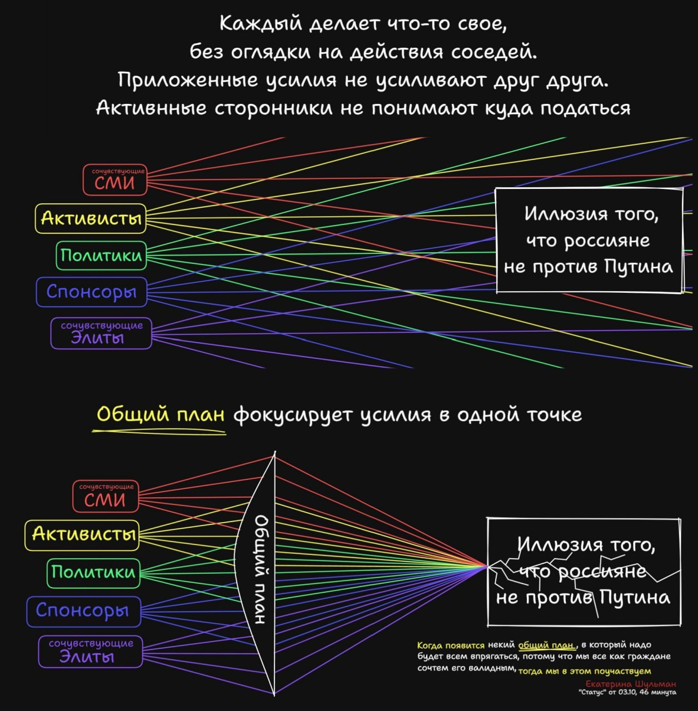
- Вскоре после убийства Навального:
  collapsed:: true
	- Поддержка украинцев:
		- https://t.me/RUSanctions/24449
		  collapsed:: true
			- 
			- 
			-
	- Нет войне:
		- https://t.me/RUSanctions/24446
		  collapsed:: true
			- 
			-
- Распределение оппозиции по позиции по Украине
  collapsed:: true
	- 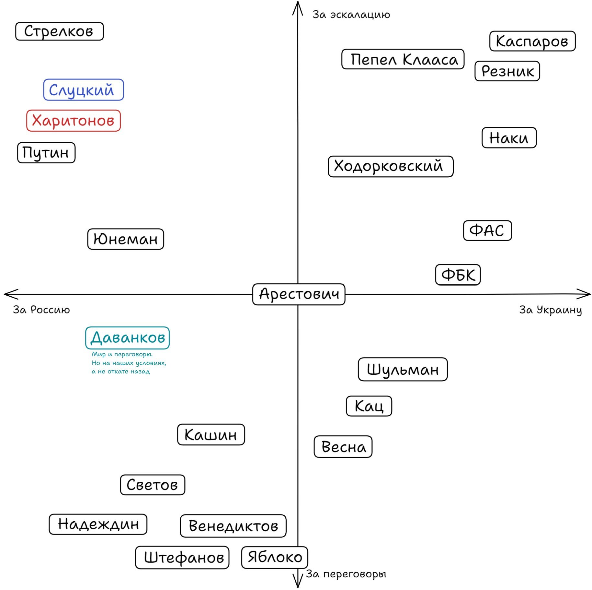
	-
- Распределение позиции аудитории разных кандитатов
  collapsed:: true
	- 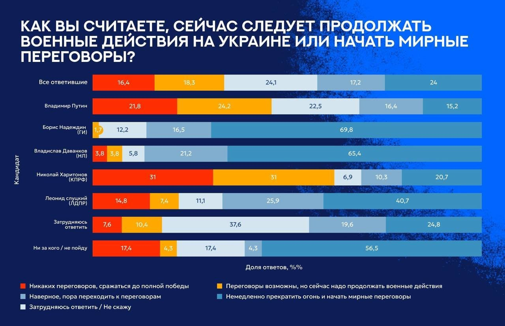
- Институт Региональных Проектов и Законодательства провел опрос с целью изучения общественного мнения и политических предпочтений жителей России.
  collapsed:: true
	- 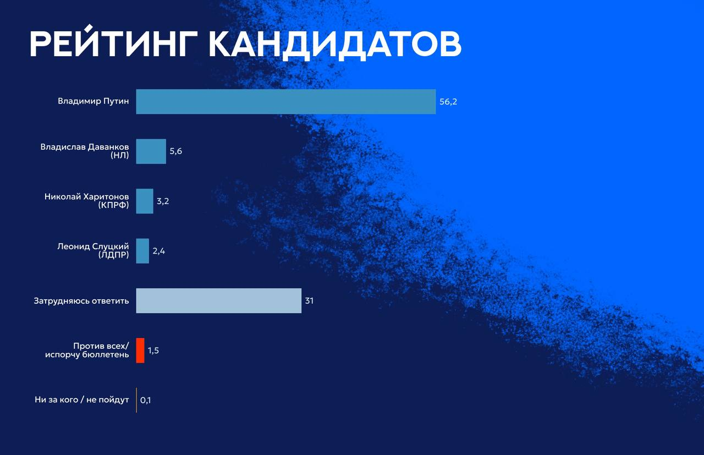
- [Интернет опрос](https://twitter.com/vlsurin/status/1766801657772265973?s=20)
  collapsed:: true
	- 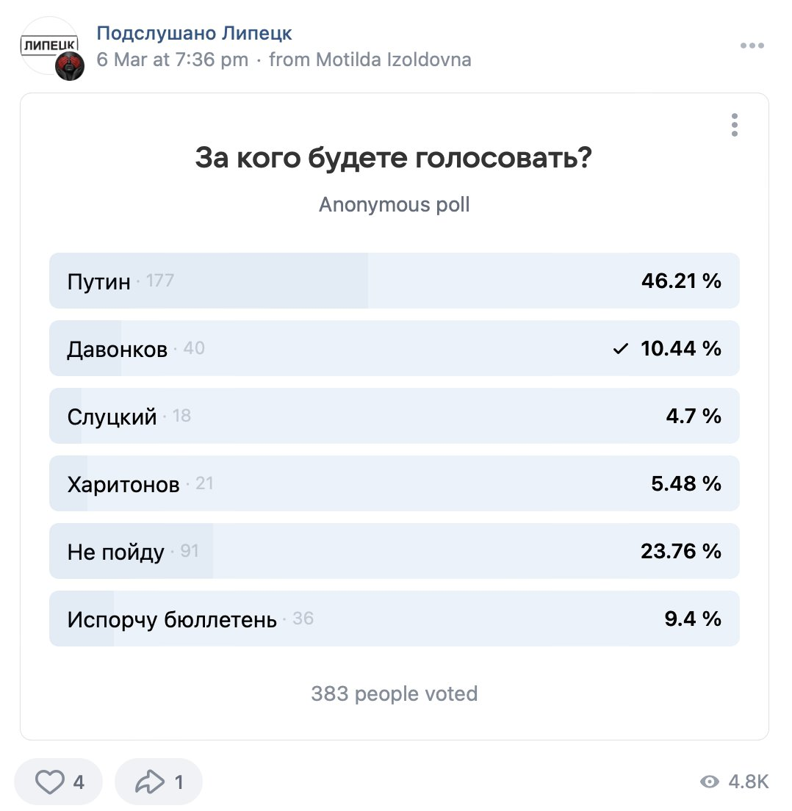
	- 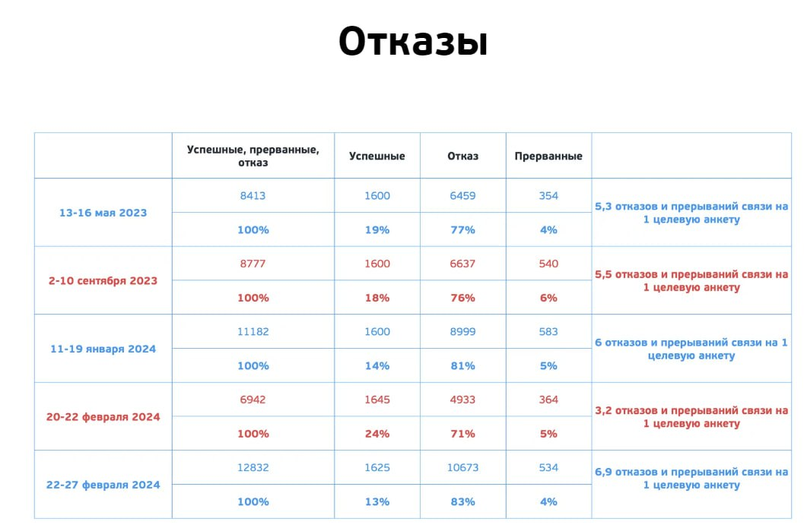
	  collapsed:: true
- Как работают интернет-тролли:
  collapsed:: true
	- 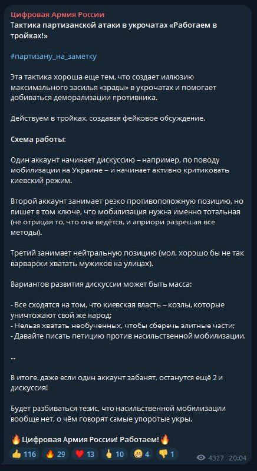
- Expected funnel
  collapsed:: true
	- 
- [[Кац]] vs [[Дождь]]
  collapsed:: true
	- Дзядко
	  collapsed:: true
		- 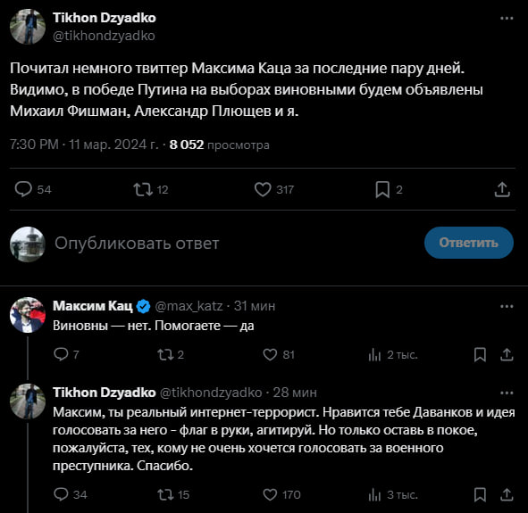
	- Фишман
		- {{embed [[2024/03/Кац-vs-Фишман]]}}
- Про Даванкова
  collapsed:: true
	- Шульман
	  collapsed:: true
		- 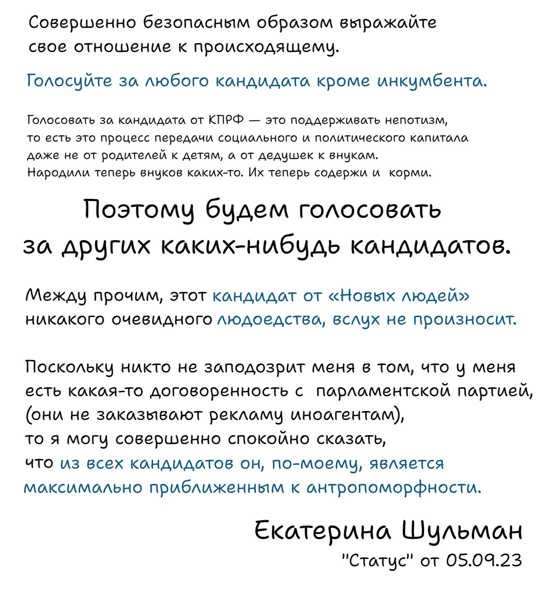
	- Волков
	  collapsed:: true
		- https://t.me/leonid_volkov/4504:
			- 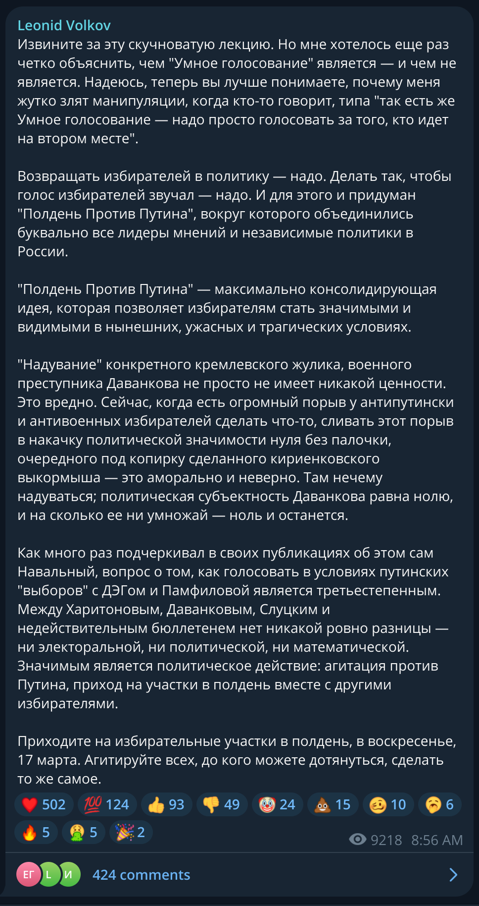
				- Извините за эту скучноватую лекцию. Но мне хотелось еще раз четко объяснить, чем "Умное голосование" является — и чем не является. Надеюсь, теперь вы лучше понимаете, почему меня жутко злят манипуляции, когда кто-то говорит, типа "так есть же Умное голосование — надо просто голосовать за того, кто идет на втором месте".
				- Возвращать избирателей в политику — надо. Делать так, чтобы голос избирателей звучал — надо. И для этого и придуман "Полдень Против Путина", вокруг которого объединились буквально все лидеры мнений и независимые политики в России.
				- "Полдень Против Путина" — максимально консолидирующая идея, которая позволяет избирателям стать значимыми и видимыми в нынешних, ужасных и трагических условиях.
				- "Надувание" конкретного кремлевского жулика, военного преступника Даванкова не просто не имеет никакой ценности. Это вредно. Сейчас, когда есть огромный порыв у антипутински и антивоенных избирателей сделать что-то, сливать этот порыв в накачку политической значимости нуля без палочки, очередного под копирку сделанного кириенковского выкормыша — это аморально и неверно. Там нечему надуваться; политическая субъектность Даванкова равна нолю, и на сколько ее ни умножай — ноль и останется.
				- Как много раз подчеркивал в своих публикациях об этом сам Навальный, вопрос о том, как голосовать в условиях путинских "выборов" с ДЭГом и Памфиловой является третьестепенным. Между Харитоновым, Даванковым, Слуцким и недействительным бюллетенем нет никакой ровно разницы — ни электоральной, ни политической, ни математической. Значимым является политическое действие: агитация против Путина, приход на участки в полдень вместе с другими избирателями.
				- Приходите на избирательные участки в полдень, в воскресенье, 17 марта. Агитируйте всех, до кого можете дотянуться, сделать то же самое.
	- Дунцова
	  collapsed:: true
		- https://t.me/c/2100829255/18 (закрытый канал, нет доступа):
			- «Я не считаю, что людям надо навязывать какой-либо вариант для голосования. Сама я приду в 12 часов дня на свой избирательный участок в Ржеве и проголосую за сменяемость власти. Но чисто математически мы можем выбрать одного кандидата, чтобы наши голоса объединились. Так все увидят, сколько граждан России хотят перемен. Владислав Даванков может стать таким ресурсом для выражения нашего мнения. Я лично проголосую за Даванкова».
		- https://www.youtube.com/live/jVPcqyqYeAQ?si=nDqfy9qCwPXpeRLt
- Даванков
  collapsed:: true
	- О войне
		- 
- [[РДК]], [[ЛСР]], [[Батальон "Сибирь"]] "участвуют" в "выборах"
  collapsed:: true
	- 2024-03-12: Будут "участвовать" в "выборах"
	  collapsed:: true
		- 
	- 2024-03-12: Объявляют о начале "участия"
	  collapsed:: true
		- 
		-
		-
	- 2024-03-12: "Участвуют"
	  collapsed:: true
		- 
		- 
		- 
		- 
		- 
		- 
		- 
	- 2024-03-12: Атаки на инфраструктуру (вероятно силами ВСУ, вероятно в поддержку РДК/ЛСР/Сибирь)
	  collapsed:: true
		- 
		- 
		-
	- 2024-03-15: "Участие" всё ещё продолжается
		- 
		-  (сообщается, что это Калужская область)
	- 2024-03-16: "Участие" всё ещё продолжается
	  collapsed:: true
		- 
- Google trends?
  collapsed:: true
	- 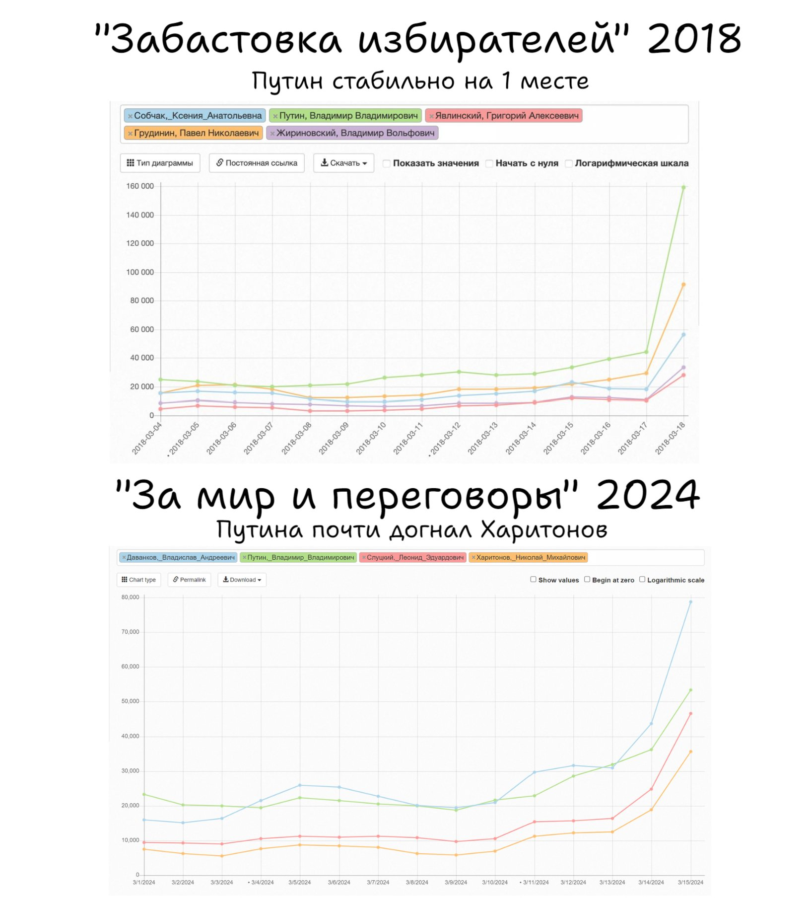
- Фальсификации
  collapsed:: true
	- [Анализ явки](https://t.me/tvrain/76134)
	  collapsed:: true
		- 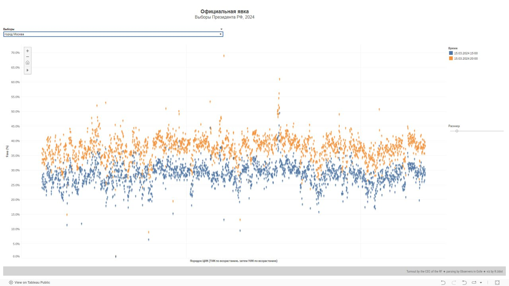
		- 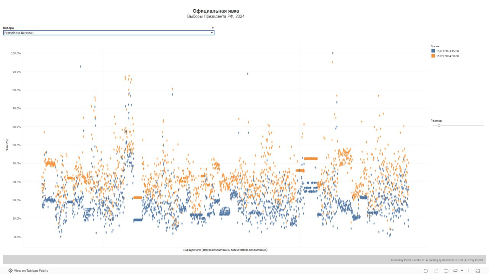
	- Примеры вбросов
	  collapsed:: true
		- 
		-  (аккуратная пачка бюллетеней за Путина)
	- Примеры реакций на сообщения о нарушениях
	  collapsed:: true
		- Вброс, сообщил Руслан Хубаев; [но задержан сообщивший, а не нарушивший](https://t.me/benyash/3492)
			- "Об этом сообщил юрист Михаил Беньяш. Руслана Хубаева, члена комиссии с правом решающего голоса, увезли в отдел полиции Центрального округа."
			- "Следом силовики задержали наблюдателя Дмитрия Королева. И Хубаев, и Королев находились на избирательном участке №2358 и обнаружили на нем вброс. Причина задержания неизвестна, оба не выходят на связь."
	- Пример почасовой разбивки голосов из ДЭГ
	  collapsed:: true
		- 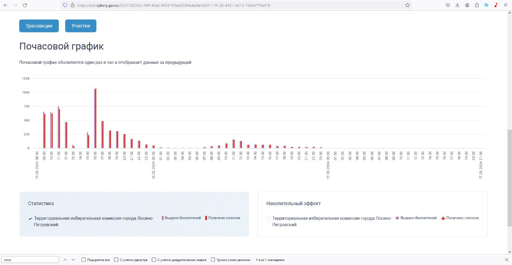
	- [Сбор сигналов о нарушениях](https://www.kartanarusheniy.org/):
	  collapsed:: true
		- 2024-03-16
		  collapsed:: true
			- 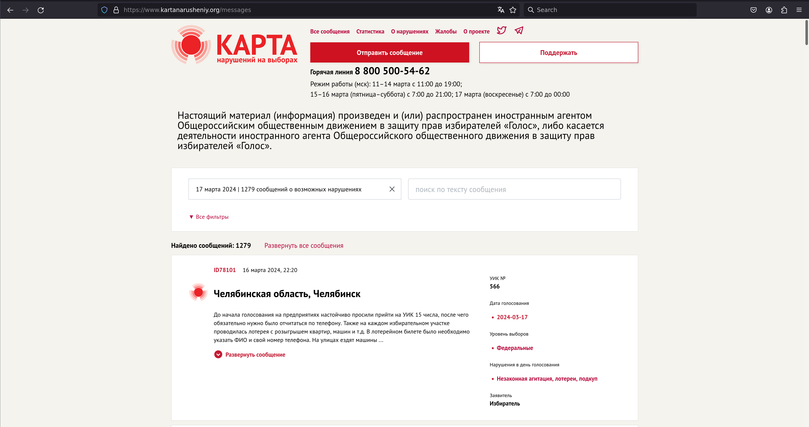
	-
- Атаки на избирательные пункты
  collapsed:: true
	- 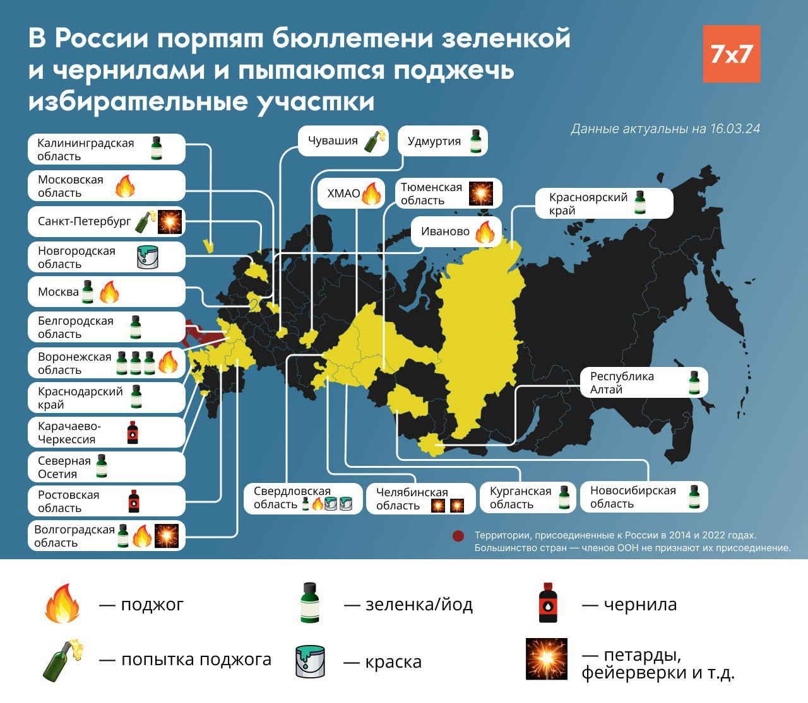